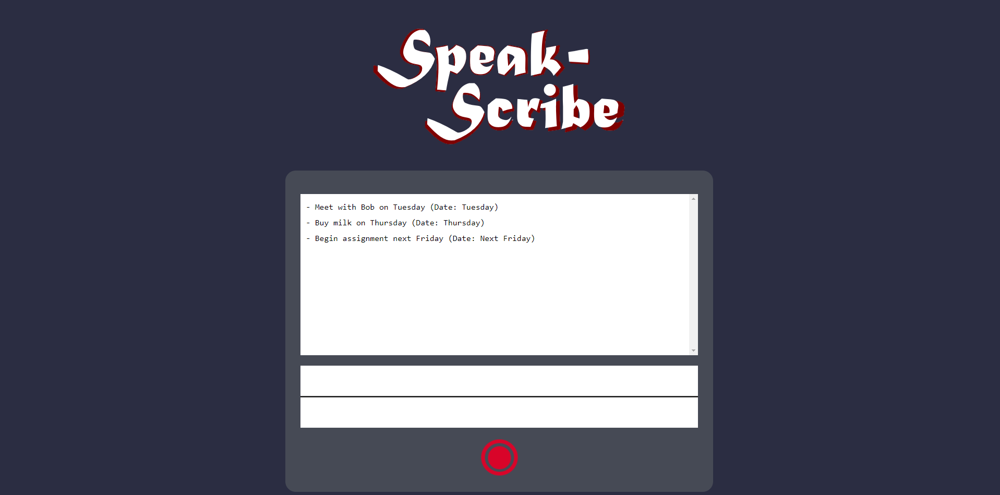

# Speak-Scribe
This is a website meant to simplify making todo lists 📝. Simply press the big red button 🔴 and start
rambling 🗣🗣 about all the tasks you've been procrastinating 🤦‍♂️ for the past month. Then POOF! 🎆🧙‍♂️🎆 watch
as Google Cloud™ ☁ speech-to-text feeds your voice to Chat GPT-3.5™ 🤖 to perfectly summarize your incoherent thoughts 😵 into a beautifully summarized list of bulleted tasks 💅. 

This project was created as part of [NewHacks 2023 at UofT](https://newhacks.ca/).

Contributors:
- Peter Kuvshinov [LinkedIn](https://www.linkedin.com/in/peter-kuvshinov/)
- Ryan Don [LinkedIn](https://www.linkedin.com/in/ryan-don/)
- David Garcia [LinkedIn](https://www.linkedin.com/in/david-garcia3/)

This project was bootstrapped with [Create React App](https://github.com/facebook/create-react-app).

## Available Scripts

### Front-End Steps

First run this to install all the necessary dependencies: 

#### `npm install --force`

Then you can run the following to start the front end:

#### `npm start`

### Back-End Steps

To start the back-end, run:

#### `python backend.py`

